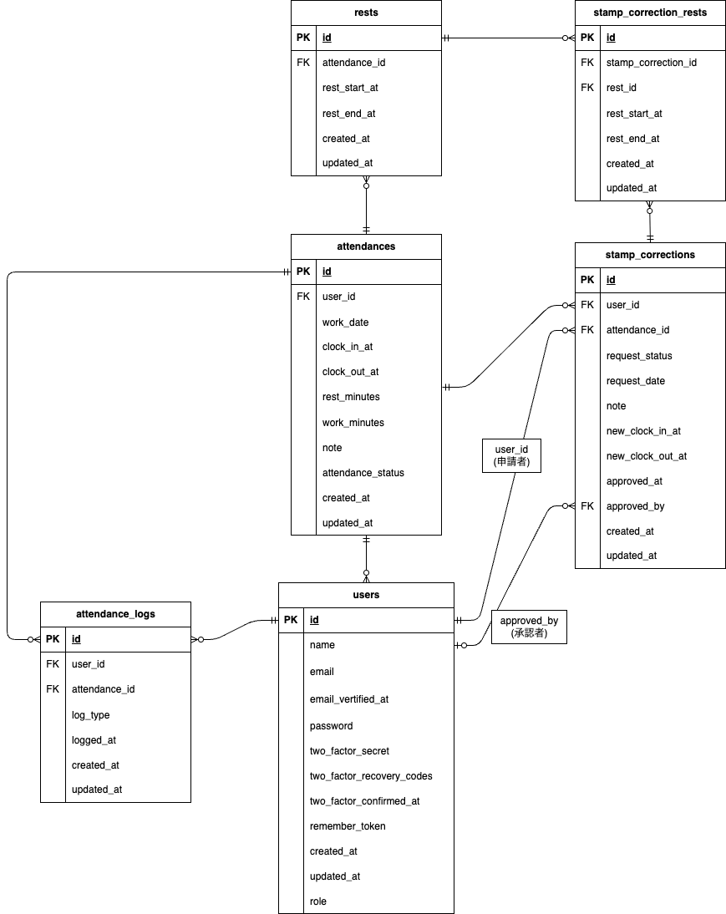

# 勤怠アプリ

## 環境構築

1. Dockerを起動する

2. プロジェクト直下で、以下のコマンドを実行する

```bash
make init
```

## 使用技術（実行環境）

- PHP : 8.1.33
- Laravel : 8.83.8
- mysql : 8.0.26
- nginx : 1.21.1
- fortify : 1.19.1

## デフォルトユーザー情報

### 管理アカウント

#### 管理者1

- email: admin1@gmail.com
- password: password

### 一般アカウント

#### 一般ユーザー1

- email: general1@gmail.com
- password: password

#### 一般ユーザー2

- email: general2@gmail.com
- password: password

## ER 図



## URL

### 開発環境

- 一般ユーザーログイン画面  
  http://localhost/login

- 管理者ユーザーログイン画面  
  http://localhost/admin/login

### phpMyAdmin

http://localhost:8080/
